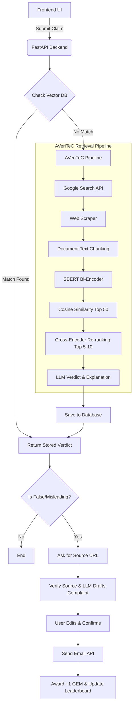

# News Verification System Architecture and Implementation Plan

This document outlines the architecture and implementation strategy for the News Verification System inspired by the AVeriTeC framework, integrating the core verification pipeline, user complaint flow, and gamification mechanics.

## 1. System Architecture

### 1.1 Technology Stack Recommendations

*   **Frontend**: React.js or Next.js (for fast rendering, responsive UI, and state management).
*   **Backend**: Python (FastAPI). Python is highly recommended for the backend due to the heavy reliance on NLP libraries (SentenceTransformers, Cross-Encoders, LangChain/LlamaIndex).
*   **Database**:
    *   **Vector Database**: Qdrant, Milvus, or PostgreSQL with `pgvector` (for fast SBERT + Cosine Similarity lookups of existing claims).
    *   **Relational Database**: PostgreSQL (for storing user profiles, GEM scores, leaderboard data, and cached verdicts).
*   **ML Models & NLP**:
    *   **Bi-Encoder**: `sentence-transformers/all-MiniLM-L6-v2` or similar (for fast initial retrieval and Top 50 filtering).
    *   **Cross-Encoder**: `cross-encoder/ms-marco-MiniLM-L-6-v2` or similar (for accurate re-ranking to Top 5-10).
    *   **LLM**: OpenAI GPT-4o, Anthropic Claude 3.5, or a local open-source model (e.g., Llama-3) for verdict generation and complaint drafting.
*   **External APIs**:
    *   **Search**: SerpAPI, Google Custom Search API, or DuckDuckGo Search API.
    *   **Email**: SendGrid, Resend, or AWS SES (for dispatching complaint emails).

### 1.2 System Components Diagram

## 2. Core Workflows

### 2.1 The Verification Workflow
1.  **Input Phase**: User lands on the homepage, navigates to the input page, and pastes a news claim.
2.  **Cache Check (Fast Path)**: The backend vectorizes the claim using SBERT and queries the Vector Database of existing claims. If a highly similar claim is found, the system instantly returns the previously computed verdict.
3.  **AVeriTeC Pipeline (Slow Path)**:
    *   The claim is used as a query for a Google Search.
    *   The system scrapes the content of the returned web pages.
    *   Scraped text is chunked into smaller segments and embedded using SBERT.
    *   The system calculates cosine similarity between the claim and the scraped chunks, filtering down to the **Top 50** most relevant chunks.
    *   A **Cross-Encoder** evaluates the Top 50 chunks against the claim to re-rank them, selecting the absolute best **Top 5-10** pieces of evidence.
    *   These Top 5-10 chunks are injected into an LLM prompt alongside the claim. The LLM outputs a structured response containing the verdict (`TRUE`, `FALSE`, `MISLEADING`, or `UNVERIFIABLE`), evidence, and a human-readable explanation.

### 2.2 Gamification & Complaint Workflow
1.  **Source Verification**: If the verdict returned is `FALSE` or `MISLEADING`, the user is prompted to provide the URL where they found the news.
2.  **Drafting**: If the user opts to file a complaint (e.g., against a publisher spreading false news), the LLM drafts a formal complaint email using the context of the verdict, evidence, and the source URL.
3.  **Review**: The user reviews and edits the draft in the UI.
4.  **Dispatch**: The backend sends the email via an SMTP service.
5.  **Reward**: Upon successful email dispatch, the user's account is credited with +1 GEM. The global leaderboard is updated to reflect the new score.

## 3. Implementation Plan

### Phase 1: Foundation & Infrastructure
*   [x] Set up the GitHub repository and project structure (Frontend & Backend workspaces).
*   [x] Provision PostgreSQL (with pgvector) or a dedicated Vector DB.
*   [x] Define database schemas (Users, Claims, Evidences, Complaints, Leaderboard).
*   [ ] Create basic frontend routing (Homepage, Input Page, Leaderboard).

### Phase 2: AVeriTeC ML Pipeline
*   [x] Implement the Web Search integration (using DuckDuckGo).
*   [x] Build a robust web scraper (using Trafilatura) with fallback and error handling.
*   [x] Implement the text chunking and SBERT embedding pipeline.
*   [x] Implement the Cross-Encoder re-ranking logic.
*   [x] Design the LLM prompt and integrate the Gemini API for verdict generation.

### Phase 3: Backend API & Integration
*   [x] Create FastAPI endpoints for claim submission.
*   [x] Implement the "Fast Path" vector similarity search for existing claims.
*   [x] Connect the AVeriTeC ML pipeline to the API endpoint (utilizing Server-Sent Events to stream progress).
*   [x] Implement user authentication to track GEMs securely.

### Phase 4: Frontend Development
*   [x] Build the Input Page with comprehensive loading states (the AVeriTeC pipeline will take several seconds to run).
*   [x] Build the Results Page to display the Verdict, Evidence, and Explanation clearly.
*   [x] Implement the Complaint UI flow (Source URL input -> Draft Review text area -> Confirm button).
*   [x] Build the Gamification Leaderboard UI.

### Phase 5: Email & Final Polish
*   [ ] Integrate an Email provider (e.g., Resend, SendGrid) to dispatch confirmed complaints.
*   [ ] Implement the backend logic to award GEMs and update user scores securely after successful email delivery.
*   [ ] Conduct end-to-end testing of the entire flow.
*   [ ] Deploy frontend (e.g., Vercel/Netlify) and backend (e.g., Render/AWS).

## User Review Required
> [!IMPORTANT]
> Please review this implementation plan. Specifically, consider:
> 1.  **Technology Preferences**: Do you have a preferred LLM provider (OpenAI vs. Anthropic vs. Local) or Vector Database?
> 2.  **Hosting**: Have you decided where this application will be hosted, as it dictates how we set up the background task processing?
> 3.  **Next Steps**: If you approve this architecture, let me know which Phase you would like to begin implementing first (e.g., setting up the initial FastAPI backend and ML pipeline).
